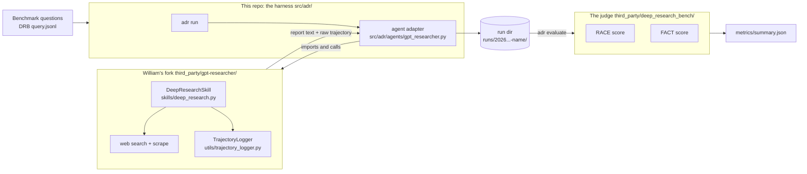
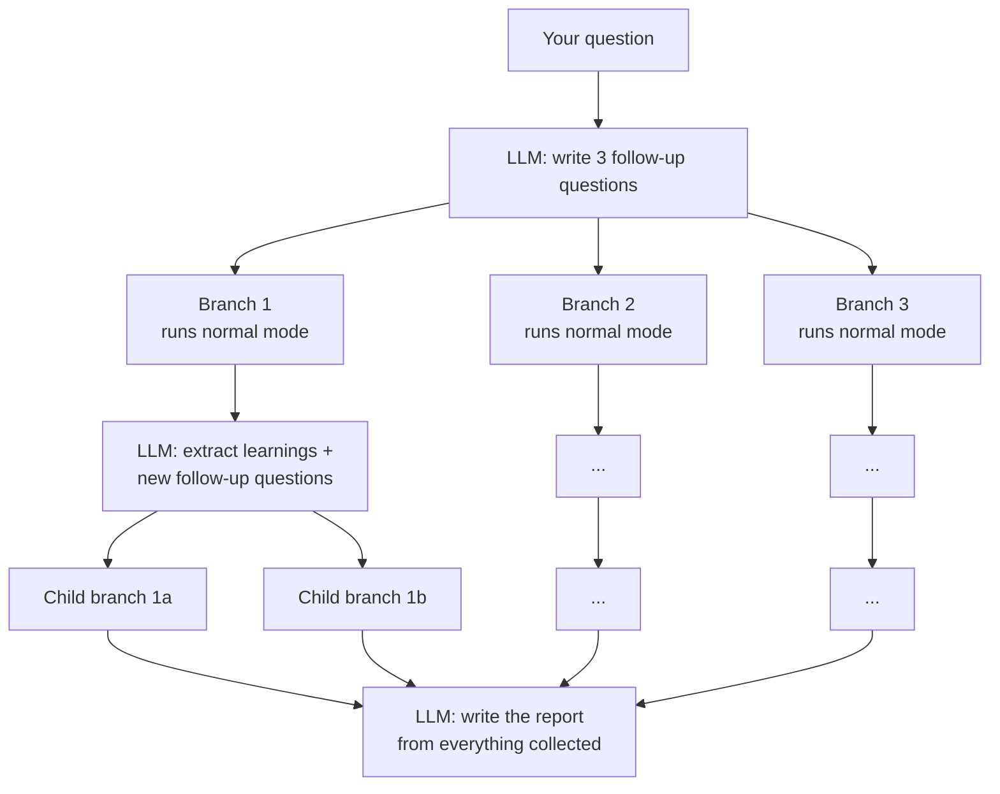
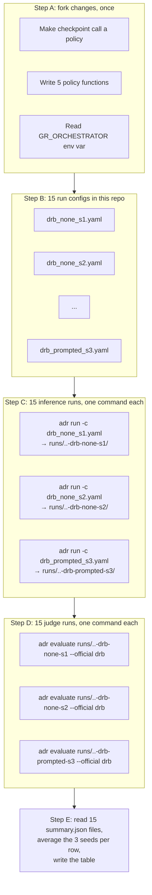

# What is everything, from scratch

Written for one reader. No prior context assumed. Every claim below points at
a file you can open.

---

## 0. The misunderstanding, cleared up first

> "How do you just judge based off of functions like no pruning? Don't you
> have to have separate runs for each architecture?"

Yes. You do. **We run inference separately for every approach.** Nothing in
the plan skips that.

Five approaches × 3 seeds = **15 separate inference runs**, each producing its
own folder of reports. The judge is then run **15 times**, once per folder. The
judge never sees the approach name; it only sees reports and grades them.

Where the confusion came from: I said "judge after inference" as a *step*, and
it read as if one judging pass covers all approaches. It doesn't. Think of it
as:

```
for approach in [none, topk, extractive, llmlingua, prompted]:
    for seed in [1, 2, 3]:
        run_dir = run_inference(approach, seed)      # the expensive part; writes reports
        judge(run_dir)                               # grades the reports in that folder
```

Two separate commands per cell of the table. The rest of this document
explains every noun in that loop.

---

## 1. The cast

There are six things. Keep them apart.

| Thing | What it is | Where it lives |
|---|---|---|
| **The paper** | "Training Policies to Prune Low-Value Context". Defines the problem (orchestration = decide what evidence to keep, where to search next, when to stop) and Table 4 (compare 5 baselines + PILOT). | The PDF you gave me |
| **gpt-researcher (upstream)** | An open-source deep research agent by assafelovic. Given a question, it searches the web, scrapes pages, and writes a long cited report. Has a "deep research" mode that explores as a tree. | github.com/assafelovic/gpt-researcher (we do not use this directly) |
| **William's fork** | gpt-researcher with **instrumentation** added: it counts tokens, measures latency, and writes a JSON log of what it kept/dropped each round. It does not change *how* research is done. | github.com/WilliamOdinson/gpt-researcher, cloned to `third_party/gpt-researcher/` |
| **This repo (the harness)** | `deepresearchagent`. A test rig. It feeds benchmark questions to an agent one by one, saves what comes back in a standard folder layout, meters cost, and hands the reports to a judge. It contains **no research logic of its own** that we use. | `src/adr/` |
| **The judge (DRB)** | DeepResearch Bench, a separate repo. Given a folder of reports, it scores each one with an LLM (RACE = quality vs a reference, FACT = are the citations real). | Cloned by `scripts/bootstrap_third_party.sh` into `third_party/deep_research_bench/` |
| **BrowseComp** | A different benchmark: 1,266 hard questions with short exact answers, in an encrypted CSV. Second PR; not covered further here. | `/tmp/browsecomp/browse_comp_test_set.csv` for now |

The relationship in one picture:



---

## 2. What gpt-researcher is (plain words)

You give it a question. It:

1. Asks an LLM to write a few search queries about the question.
2. Runs each query on a search engine (Tavily by default).
3. Scrapes the result pages.
4. Cuts each page into ~1000-character chunks and **throws away chunks that
   don't look similar to the query** (an embedding similarity filter).
5. Hands the surviving chunks to an LLM and asks it to write a report with
   citations.

That's "normal" mode. **Deep research mode** (`report_type="deep"`) does the
same thing but as a tree:



Two knobs control the tree: `depth` (how many levels) and `breadth` (how many
branches per level). Each "normal mode" box is a full mini gpt-researcher run.
All of this is in `third_party/gpt-researcher/gpt_researcher/skills/deep_research.py`,
function `deep_research()` (line 402) which calls itself recursively at line 657.

**The vocabulary from the paper maps onto this tree:**

| Paper word | In gpt-researcher |
|---|---|
| Round `t` | One level of the tree finishing (all branches at that level came back) |
| Evidence pool `C_t` | All the page chunks collected so far |
| Retained set `K_t` | The chunks that survive to the final report |
| Frontier | The open branches that could still be expanded |
| Orchestration action `(u_t, m_t, w_t)` | stop or continue / which evidence to keep / how many child branches each open branch gets |

---

## 3. What William's fork adds

Nothing about *how* research is done. It adds **measurement**:

| Added file | What it does |
|---|---|
| `gpt_researcher/utils/token_tracker.py` | Every LLM call reports its token usage here. `TokenTracker.get_totals()` gives input/output tokens for the whole run. |
| `gpt_researcher/utils/latency_tracker.py` | Counts and times every LLM call and search call. |
| `gpt_researcher/utils/trajectory_logger.py` | Builds the JSON log: which pages were seen each round, which were kept, which pruned, what the frontier looked like, how much the round cost. Saves `trajectory_<id>.json` and an `_emb.npz` of page embeddings. |
| `gpt_researcher/skills/deep_research.py` lines 543–641 | The "orchestration checkpoint". After each tree level finishes, it collects that level's pages, asks "did the similarity filter keep or drop this page?", and writes the answer into the trajectory. |

Read that last row carefully. The checkpoint **observes** what the built-in
similarity filter already did. It does not make its own decision. Concretely:

```543:545:third_party/gpt-researcher/gpt_researcher/skills/deep_research.py
        # -- Orchestration checkpoint: aggregate this layer's evidence --
        round_id = self.trajectory_logger.begin_round()

```

```629:635:third_party/gpt-researcher/gpt_researcher/skills/deep_research.py
        self.trajectory_logger.record_round(
            kept_item_ids=kept_ids,
            pruned_item_ids=pruned_ids,
            frontier=frontier_nodes,
            round_cost=round_cost,
            decision_type="continue",
        )
```

`decision_type="continue"` is a literal string. `branch_allocation` isn't
passed. The context that flows on to the next level (`all_context`) isn't
modified by this block. So today the fork has exactly **one** behaviour, and
that behaviour is decided by the similarity filter in
`gpt_researcher/context/compression.py:219-221`, not by the checkpoint.

**This is why the fork needs code changes before Table 4 can exist.** Right
now there is one architecture. We need five. That work — turning the
checkpoint from a recorder into a decider, and writing the five policy
functions — is described in `HOWTO_DRB.md` §4 and is not done yet.

---

## 4. What this repo (the harness) does

It is a test rig. Its job is to make "run agent X on benchmark Y and score it"
a repeatable command, and to make sure cost is measured the same way for every
agent. File map:

| Path | Role |
|---|---|
| `src/adr/cli.py` | The `adr` command: `run`, `evaluate`, `score`, `compare`, `dag`, `doctor`, `bootstrap`. |
| `src/adr/runner/experiment.py` | `run_experiment()`: the loop that runs one query at a time, writes the run folder, calls the judge if asked. |
| `src/adr/datasets/loader.py` | Reads benchmark question files (DRB, Gym) into `Query` objects. |
| `src/adr/agents/base.py` | The interface every agent must implement: `async run(task, ctx) -> Trajectory`. |
| `src/adr/agents/gpt_researcher.py` | **The adapter.** Sets env vars from the YAML, imports the fork, calls `GPTResearcher(query, report_type="deep")`, then converts the fork's raw trajectory into the harness's `Trajectory` shape. |
| `src/adr/agents/registry.py` | Maps the name `gpt_researcher` in a YAML to that adapter class. |
| `src/adr/agents/deep_research.py`, `pilot.py`, `fixture.py` | Other agents. `deep_research.py` is a 27-line placeholder; `fixture.py` returns canned output for tests. **Not what we run.** |
| `src/adr/core/types.py` | The `Trajectory` schema: query, steps, evidence kept/pruned, report, final stats. |
| `src/adr/core/instrument.py` | `CostMeter`: counts LLM and search calls made *through the harness*. For gpt-researcher this is empty and the adapter fills it from `TokenTracker` instead. |
| `src/adr/eval/exporters.py` | Rewrites reports into the exact file format the judge repo expects. |
| `src/adr/eval/deep_research_bench.py` | Calls the judge repo's scripts (RACE, FACT) as subprocesses, reads their result files back. |
| `src/adr/eval/local_metrics.py` | Cheap metrics that need no LLM: tokens, calls, latency, prune rate, article length. |
| `src/adr/eval/dag.py` | Renders a trajectory as a Mermaid/DOT graph (`adr dag`). |
| `configs/agents/gpt_researcher.yaml` | Knobs for the adapter: depth, breadth, retriever, and an `env:` block forwarded to the fork. |
| `configs/gpt_researcher_gym.yaml` | A complete run config: which dataset, which agent, seed, output dir. |
| `configs/eval/deep_research_bench.yaml` | Judge settings: workers, whether to run RACE/FACT. |

The harness contains **no** search, scrape, or report-writing code that we
use. All of that is the fork. The adapter is a translator.

---

## 5. One inference run, end to end

Command:

```bash
adr run -c configs/drb_topk_seed1.yaml
```

What happens, in order (`src/adr/runner/experiment.py:44-131`):

1. Make a folder: `runs/<timestamp>-<run_name>/`. Save the config into it.
2. Load the questions (`dataset:` block). For DRB that's 100 questions from
   the judge repo's `data/prompt_data/query.jsonl`, or fewer with `limit:`.
3. Build the agent named in `agent:` — here `gpt_researcher`, which loads
   `configs/agents/gpt_researcher.yaml`, sets `DEEP_RESEARCH_DEPTH`,
   `DEEP_RESEARCH_BREADTH`, everything in `env:`, then imports the fork.
4. For each question, one at a time (`concurrency: 1`, because the fork's
   trackers are global): call the fork, wait 5–10 minutes, get back a report
   string and a raw trajectory. Convert. Write three files.
5. Compute local metrics over all trajectories.
6. Export the reports into judge format.
7. If `eval.official_benches` is non-empty, run the judge now. (We won't; see §7.)
8. Write `metrics/summary.json` and `manifest.json`.

The folder afterwards:

```
runs/20260910-141500-drb-topk-s1/
├── config.yaml                       # exactly what was run
├── manifest.json
├── queries/<id>.json                 # the question
├── reports/<id>.md                   # the report the fork wrote  ← the judge reads these
├── trajectories/<id>.json            # harness Trajectory: steps, kept/pruned, tokens, latency
├── gpt_researcher/<id>.json          # the fork's raw trajectory (rounds, decision, frontier)
├── gpt_researcher/<id>_emb.npz       # page embeddings                         ← RL corpus later
├── exports/deep_research_bench/gpt_researcher.jsonl   # reports in judge format
└── metrics/
    ├── local.json                    # tokens, calls, latency, prune rate per query
    └── summary.json
```

**Which approach was used is baked into this folder** in three places: the
`env: GR_ORCHESTRATOR` value in `config.yaml`, the `decision` blocks in
`gpt_researcher/<id>.json`, and of course the reports themselves. A run folder
*is* one approach on one seed.

---

## 6. What the judge is and why it is a separate thing

DeepResearch Bench (DRB) is someone else's repo. It contains 100 research
questions, a reference article for each, and two grading scripts:

- **RACE** (`deepresearch_bench_race.py`): an LLM reads your report and the
  reference article for the same question and scores comprehensiveness,
  depth, instruction-following, readability. Produces `race_result.txt`.
- **FACT** (`utils/extract → deduplicate → scrape → validate → stat`): pulls
  every citation out of your report, fetches the URLs, asks an LLM whether the
  cited page actually supports the claim. Produces `fact_result.txt`.

The judge's input is **a folder of reports**. Its interface is: put a file
named `<model_name>.jsonl` with `{id, prompt, article}` rows into
`data/test_data/raw_data/`, run the script with `<model_name>`, read
`results/race/<model_name>/race_result.txt`.

It does not know what gpt-researcher is. It does not know what "top-k" means.
It grades essays. Analogy: the approach is the student's study method, the run
folder is the exam paper they handed in, the judge is the grader. The grader
grades one paper at a time and doesn't ask how the student studied. To compare
five study methods you need five exam papers and you grade all five.

The harness wrapper for this is `src/adr/eval/deep_research_bench.py`. It
copies your export file into the judge's `raw_data/` (line 80-82), runs RACE
(line 105) and FACT (line 146), parses the result files.

**The overwrite problem.** Look at line 80:

```80:82:src/adr/eval/deep_research_bench.py
    dest = bench_root / "data" / "test_data" / "raw_data" / f"{model_name}.jsonl"
    dest.parent.mkdir(parents=True, exist_ok=True)
    dest.write_text(export_path.read_text(encoding="utf-8"), encoding="utf-8")
```

`model_name` comes from `agent.name` in the config, which is `gpt_researcher`
for *every* row. If you judge the `none` run, then the `topk` run, the second
copy overwrites the first inside the judge repo, and `results/race/gpt_researcher/`
now holds topk's scores with none's gone. That's the whole reason for the
"unique run dir names" remark: `adr evaluate <run_dir>` without a config uses
the **folder name** as `model_name` (`experiment.py:143`), so
`runs/...-drb-topk-s1` and `runs/...-drb-none-s1` land in different judge
result folders and nothing is overwritten.

---

## 7. Putting it together: how Table 4 gets built



Each run config differs from the others in exactly two lines:

```yaml
run_name: drb-topk-s1          # unique → unique folder → unique judge results
seed: 1
agent:
  name: gpt_researcher
  config: configs/agents/gpt_researcher.yaml
  env:
    GR_ORCHESTRATOR: topk       # ← the approach
    GR_TOKEN_BUDGET: "48000"    # ← matched budget, from the none rows
```

Everything else — dataset, depth, breadth, retriever, models — is identical
across all 15. If it isn't, the table is measuring the difference you
introduced, not the orchestration.

**Why `adr run` then `adr evaluate`, instead of `adr run --official drb` in
one go?** Two reasons. First, the overwrite bug above: `--official` inside
`run` uses `agent.name` as `model_name`, so all rows collide. Second, inference
is the expensive step (~$0.65 and ~7 minutes per question); judging is cheap
and re-runnable. Keeping them separate means a judge failure (bad API key,
Jina rate limit) never forces you to redo inference.

---

## 8. Where each Table 4 column comes from

For one row (average over the 3 seed folders):

| Column | File | Field |
|---|---|---|
| RACE | `<judge repo>/results/race/<run_dir_name>/race_result.txt`, mirrored into `runs/<run>/metrics/summary.json` | `official.deep_research_bench.race.scores` |
| FACT | same, `fact_result.txt` | `official.deep_research_bench.fact.scores` |
| Tokens (K) | `runs/<run>/metrics/local.json` | mean of `per_query[*].tokens` / 1000 |
| Latency (s) | same | mean of `per_query[*].wall_s` |
| LLM calls | same | mean of `per_query[*].n_llm_calls` |
| Search calls | same | mean of `per_query[*].n_searches` |
| Prune rate | same | mean of `per_query[*].prune_rate` |

Tokens come from the fork's `TokenTracker` (what the API billed), not from an
estimate. The adapter copies them into the harness at
`src/adr/agents/gpt_researcher.py:263-282`.

---

## 9. What exists today vs. what doesn't

| | Exists | Does not exist yet |
|---|---|---|
| Fork | Tree research, token/latency tracking, trajectory JSON with a **recorded** decision per round | The policy switch; any of the 5 policies; `u` and `w` actually doing anything |
| Harness | `adr run` for DRB and Gym, the gpt-researcher adapter, export to judge format, judge wrapper, local metrics, `adr dag` | A DRB run config for gpt-researcher (only the Gym one exists); an `adr table` command to average seeds; BrowseComp loader/judge |
| Judge | The DRB repo, callable via `adr evaluate` | Nothing missing, but its API key env var is `GEMINI_API_KEY` on the real checkout while `deep_research_bench.py` checks `OPENAI_API_KEY`/`OPENROUTER_API_KEY` — see `HOWTO_DRB.md` §2 for the workaround |
| Data | DRB questions ship with the judge repo; BrowseComp CSV downloaded to `/tmp` | BrowseComp under `data/benchmarks/` |

Order of work: fork changes → one DRB run config → smoke test with the mock
LLM to confirm `GR_ORCHESTRATOR` changes the trajectory's `decision` field →
`none` rows for real → read their token mean → the other four rows with that
budget → judge all 15 → table.

---

## 10. Glossary

- **Agent** — anything that takes a question and returns a report. Here: the fork, wrapped by the adapter.
- **Adapter** — `src/adr/agents/gpt_researcher.py`. Translates between the harness's interface and the fork's.
- **Backbone** — the frozen research machinery (search, scrape, chunk, filter, write). Same for every row.
- **Orchestrator / policy** — the function that decides `(u, m, w)` at each round. This is the only thing that changes between rows.
- **u** — stop or continue.
- **m** — set of evidence ids to keep. Some policies keep all ids but shorten the text.
- **w** — weights over open branches; decides how many child searches each gets.
- **Round / checkpoint** — one tree level finishing; the moment the policy runs.
- **Trajectory** — the log of a run. Two flavours: the fork's raw one (`gpt_researcher/<id>.json`, has rounds and decisions) and the harness's normalized one (`trajectories/<id>.json`, has steps and cost).
- **Run dir** — one folder = one approach × one seed × one dataset.
- **Judge** — DRB's RACE + FACT scripts. Grades reports; knows nothing about approaches.
- **RACE** — report quality vs a reference article, LLM-scored.
- **FACT** — citation accuracy: are the cited pages real and do they support the claim.
- **Matched budget** — give every pruning row the same token allowance (the `none` row's mean) so quality differences aren't just spending differences.
- **Seed** — random seed; three per row so the table has error bars.
- **`adr run`** — inference: produce a run dir.
- **`adr evaluate <run_dir>`** — judging: score an existing run dir.
- **`adr dag <trajectory>`** — draw one trajectory as a graph.
